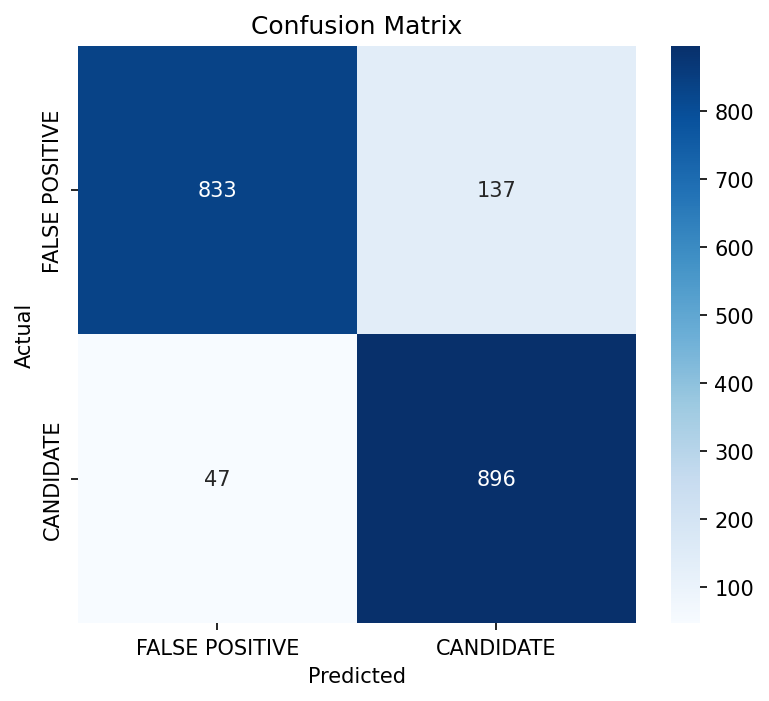

# Kepler Exoplanet Classifier

NASA Kepler telescope er data diye planet candidate vs false-positive classify kora — a binary tabular classification project.

## Dataset

- **Source:** NASA Exoplanet Archive (Cumulative KOI Table)
- **Size:** 9,564 rows × 49 columns
- **Target:** `koi_pdisposition` (CANDIDATE vs FALSE POSITIVE)

## EDA Summary

- Target classes are nearly balanced (~50% CANDIDATE, ~51% FALSE POSITIVE).
- Two empty columns dropped; identifier/text columns removed.
- Missing values (~5%) filled using median imputation.
- No strongly redundant features found (highest correlation ~0.58).

## Model

- **Algorithm:** Logistic Regression (with StandardScaler for feature scaling)
- **Train/Test Split:** 80/20, stratified

## Results

| Metric    | Score |
| --------- | ----- |
| Accuracy  | 90.4% |
| Precision | 86.7% |
| Recall    | 95.0% |

**Key insight:** The model correctly identifies 95% of real planet candidates, missing only 47 out of 943 — important since missing a real planet (false negative) is more costly than a false alarm.

## Status

✅ EDA complete
✅ Model trained and evaluated
🚧 Next: feature importance analysis

## Tech Stack

pandas, numpy, scikit-learn, matplotlib, seaborn
