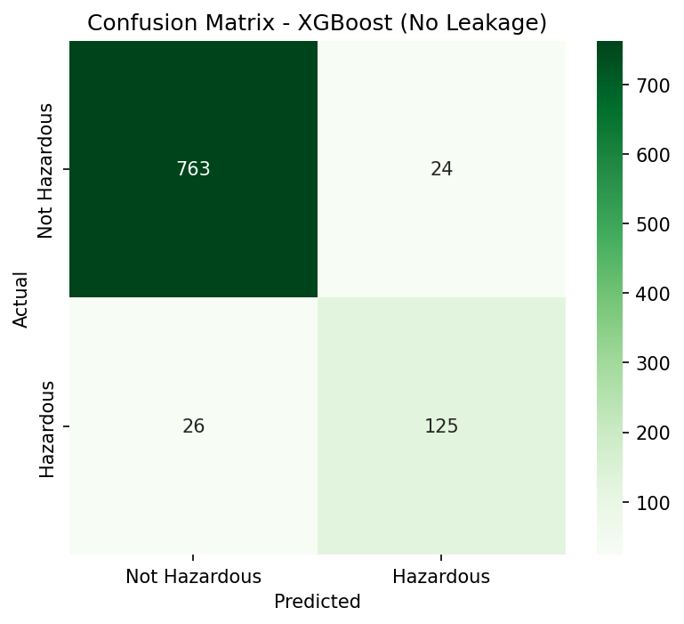
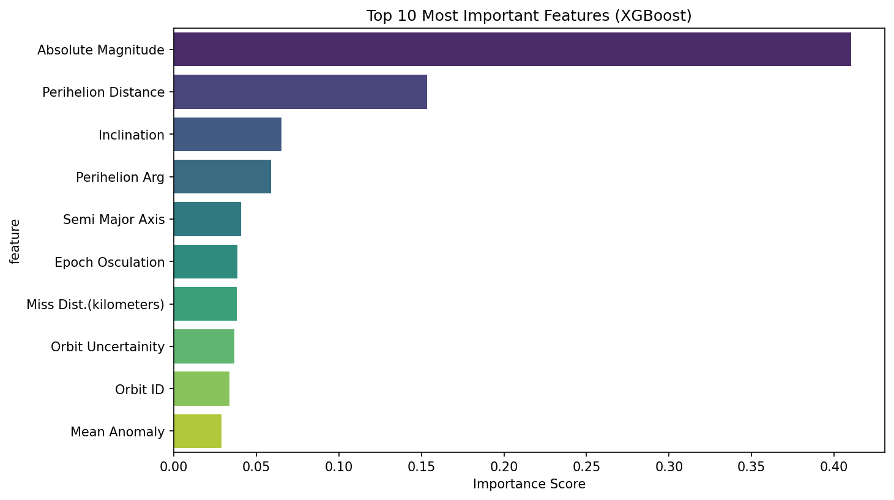

# Asteroid Hazard Classifier

NASA NEO (Near-Earth Object) data diye asteroid hazardous naki na classify kora — a binary tabular classification project with imbalanced classes.

## Dataset

- **Source:** Kaggle (NASA Asteroids Classification)
- **Size:** 4,687 asteroids × 40 columns (reduced to 15 features after cleaning)
- **Target:** Hazardous (True/False)

## EDA Summary

- Target is imbalanced: 83.9% Not Hazardous, 16.1% Hazardous.
- Removed duplicate-unit columns (diameter/velocity/distance measured in multiple units).
- Removed constant columns and highly correlated orbit features (>0.9 correlation).

## Data Leakage Discovery

Initial Random Forest model scored 99.8% accuracy — a red flag. Investigation revealed `Minimum Orbit Intersection` (MOID) directly encodes the official hazard-classification rule (MOID < 0.05 AU = hazardous). This feature was dropped to build an honest model.

## Models Compared

| Model                           | Accuracy  | Precision | Recall    |
| ------------------------------- | --------- | --------- | --------- |
| Logistic Regression (with MOID) | 95.2%     | 87.3%     | 82.1%     |
| Random Forest (no leak)         | 92.2%     | 90.6%     | 57.6%     |
| **XGBoost (no leak)**           | **94.7%** | **83.9%** | **82.8%** |

**Final model: XGBoost** — best recall without data leakage, using `scale_pos_weight` to handle class imbalance.

**Top predictive features:** Absolute Magnitude (proxy for asteroid size) and Perihelion Distance were the strongest predictors — both physically meaningful for hazard assessment.

## Status

✅ Project complete

## Tech Stack

pandas, numpy, scikit-learn, xgboost, matplotlib, seaborn
