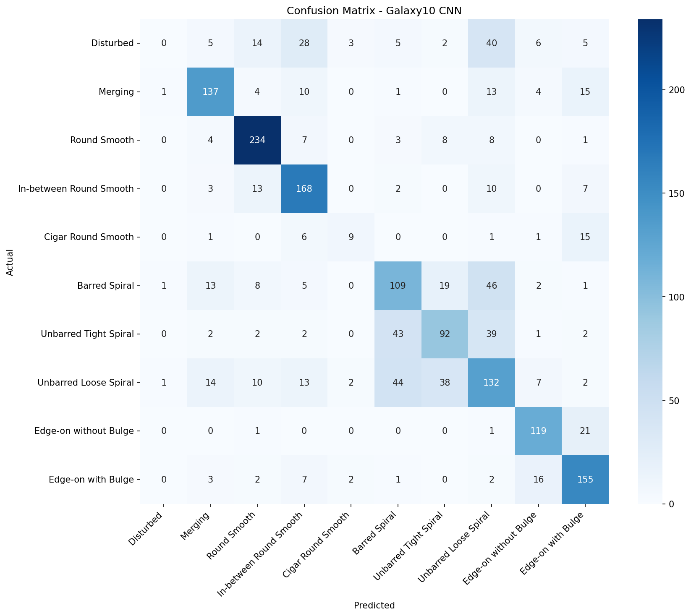

# Galaxy10 Morphology Classifier

Classifying galaxy shapes (spiral, elliptical, edge-on, etc.) from real telescope images using a Convolutional Neural Network — first image classification project in this portfolio.

## Dataset

- **Source:** astroNN Galaxy10 DECaLS (images from DESI Legacy Imaging Surveys, labels from Galaxy Zoo)
- **Size:** 17,736 total images, 256×256 RGB. Used a stratified 50% subset (8,868 images) to work within available memory.
- **Classes:** 10 galaxy morphology types (Disturbed, Merging, Round Smooth, In-between Round Smooth, Cigar Round Smooth, Barred Spiral, Unbarred Tight Spiral, Unbarred Loose Spiral, Edge-on without Bulge, Edge-on with Bulge)
- Class distribution is imbalanced — Cigar Round Smooth has only ~330 images vs ~2,650 for the largest class.

## Model

- **Architecture:** Custom CNN — 3 Conv2D+MaxPooling blocks (32→64→128 filters), followed by a Dense layer with dropout, trained from scratch.
- **Preprocessing:** Pixel normalization (0-255 → 0-1).
- **Improvement iteration:** Initial model overfit after ~8 epochs (validation accuracy plateaued at 45%). Added data augmentation (random flip, rotation, zoom) and early stopping, which improved validation accuracy to 65% with no overfitting.

## Results

- **Overall accuracy: 65%** (vs ~10% for random guessing across 10 classes)
- Best performing classes: Round Smooth (88% recall), Edge-on galaxies (82-84% recall) — visually distinctive shapes.
- Weakest class: "Disturbed" (0% recall) — this category has no consistent visual signature and gets confused with multiple other classes, especially irregular/spiral shapes.
- Spiral subtypes (Barred/Tight/Unbarred Loose) frequently confused with each other — expected, since these shapes are subtly different even to human classifiers (which is why Galaxy Zoo used crowd-sourced voting).

## Status

✅ Project complete

## Tech Stack

tensorflow/keras, astroNN, numpy, matplotlib, seaborn, scikit-learn
